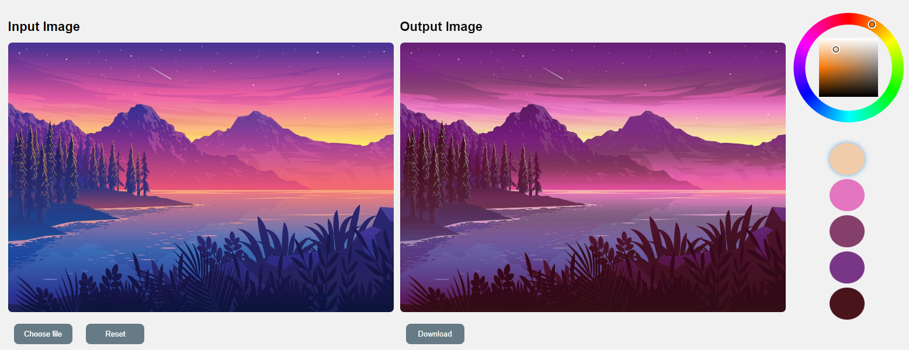

# DIGIMAP - HueWiz

Welcome to HueWiz, a recoloring app designed to help you unleash your creativity and color-transform your photos in exciting new ways! This app is based on the paper "Palette-Based Photo Recoloring" by Chang et al, 2015.

## How to Run the App

1. Download and unzip the folder.
2. Open the `index.html` file in your preferred web browser.

## Demo Links
- https://digimap-color-transfer-omega.vercel.app/
- https://drey037.github.io/DIGIMAP-ColorTransfer/
- https://huewiz-colortransfer.netlify.app/

## Instructions Manual

For detailed instructions on how to use HueWiz, please refer to the [Instructions Manual](https://bit.ly/DIGIMAP-HueWiz).

## References
1. Palette-based Photo Recoloring:
	https://gfx.cs.princeton.edu/pubs/Chang_2015_PPR/index.php

2. Color Feature Based Dominant Color Extraction:
	https://ieeexplore.ieee.org/document/9869653

## Code Sources
1. [Palette-based Photo Recoloring - Original Demo](https://recolor.cs.princeton.edu/demo/index.html)

2. [Palette-based Photo Recoloring - Github Repo](https://github.com/b-z/photo_recoloring)

---
